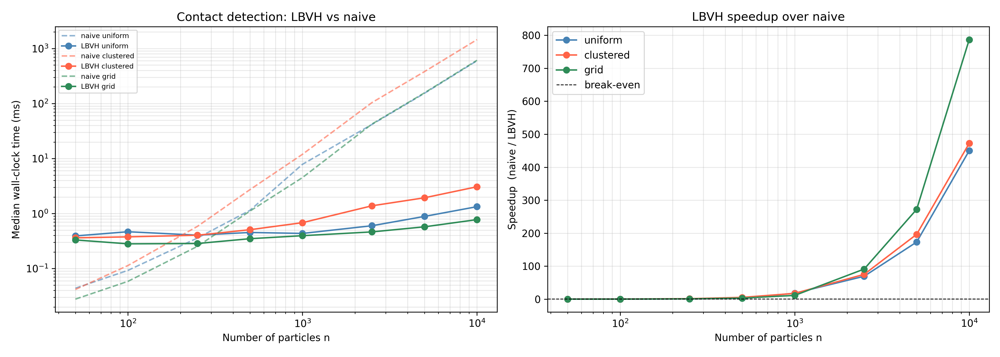

# LBVH-GPU

This repository contains a GPU-based implementation of a Linear Bounding Volume Hierarchy (LBVH) for efficient spatial queries, such as collision detection and neighbor search. The LBVH is built on the GPU to leverage parallel processing capabilities, making it suitable for large datasets and real-time applications. The implementation is based on [Karras' 2012 paper](https://research.nvidia.com/sites/default/files/pubs/2012-06_Maximizing-Parallelism-in/karras2012hpg_paper.pdf).

## Context

I implemented this algorithm in C with OpenCL in the context of the course [LMECA2300 - Advanced Numerical Methods](https://uclouvain.be/en-cours-2025-lmeca2300) at UCLouvain. This course focuses on granular simulations and, in the particular case of the project for which this implementation was developed, Non-Smooth Contact Dynamics (NSCD) simulations. The LBVH is used to efficiently find pairs of particles that are close enough to potentially interact, which is a crucial step in NSCD simulations.

## Structure

```text
LBVH-GPU/
├── lbvh/                    # C/OpenCL library (core implementation)
│   ├── include/
│   │   ├── common.h         # Common headers shared across host files
│   │   ├── shared_types.h   # Types shared between host (C) and device (OpenCL) code
│   │   └── lbvh.h           # Public API of the library
│   ├── kernels.cl           # OpenCL GPU kernels (Morton codes, tree build, etc.)
│   ├── lbvh.c               # Host-side implementation (OpenCL context, memory, etc.)
│   ├── liblbvh.so           # Compiled shared library
│   ├── test_simple.c        # Minimal C test for the library
│   └── Makefile             # Build rules for the shared library
├── python/                  # Python bindings and tooling
│   ├── lbvh_wrapper.py      # ctypes wrapper exposing LBVHTree to Python
│   ├── test_lbvh.py         # Randomised validation against a brute-force reference
│   └── benchmark_lbvh.py    # Wall-clock benchmark: LBVH vs naive O(n²) detection
├── figures/
│   └── benchmark_lbvh.png   # Benchmark results plot
├── Karras_2012.pdf          # Reference paper (Karras, 2012)
└── requirements.txt         # Python dependencies
```

## Usage

### Prerequisites

- A C compiler (`gcc`) and OpenCL development headers/libraries
- The following Python packages: 

    ```text
    numpy
    matplotlib 
    ```

### Building the shared library

```bash
cd lbvh
make
```

This produces `lbvh/liblbvh.so`. To also build and run the minimal C test:

```bash
make test && ./test
```

### Using the C API directly

Include `lbvh/include/lbvh.h` and link against `liblbvh.so` and `-lOpenCL`.

The typical call sequence at each simulation timestep is:

```c
#include "lbvh.h"

// Once at startup
LBVH* tree = lbvh_create(n_particles, max_pairs);

// Each timestep — update positions then rebuild
lbvh_build(tree, x, y, r, n_particles, alert);

// Read back candidate contact pairs as (i, j) index pairs
int pairs[2 * max_pairs];
int n_pairs = lbvh_query_pairs(tree, pairs, max_pairs);

// At shutdown
lbvh_destroy(tree);
```

`alert` is a distance margin added to each particle bounding box when testing AABB overlap.

### Using the Python wrapper

Run scripts from the repository root so that `lbvh/liblbvh.so` is resolved correctly.

```python
import numpy as np
from python.lbvh_wrapper import LBVHTree

n = 1000
tree = LBVHTree(n, max_pairs=50000)

# Generate random particle data (x, y, r)
x = np.random.uniform(0, 10, n).astype(np.float32)
y = np.random.uniform(0, 10, n).astype(np.float32)
r = np.full(n, 0.5, dtype=np.float32)

tree.build(x, y, r, alert=0.1)
pairs = tree.query()   # ndarray of shape (k, 2)
```

### Running the tests and benchmark

```bash
# Correctness tests (validates against brute-force O(n²) reference)
python python/test_lbvh.py

# Wall-clock benchmark across particle counts and spatial distributions
python python/benchmark_lbvh.py
```

### Results

We observe a whopping speedup between $500$ to $800 \times$ compared to the naive $\mathcal{O}(n^2)$ approach ! (see right plot) \
The LBVH scales much better with increasing particle numbers, making it suitable for large-scale simulations.



## Acknowledgements

Special thanks to Joachim de Favereau de Jeneret [@Joachim-defav](https://github.com/Joachim-defav) for helpful discussions on the algorithm.
